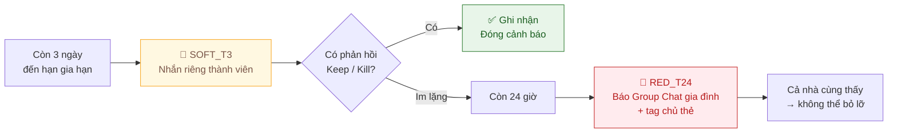
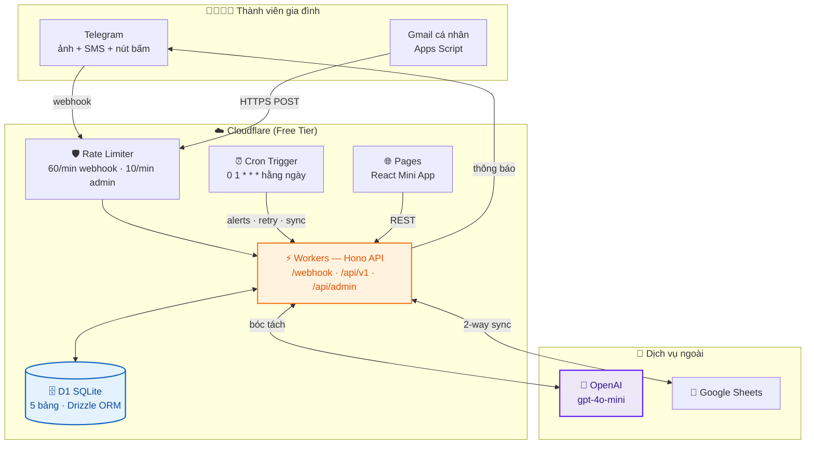
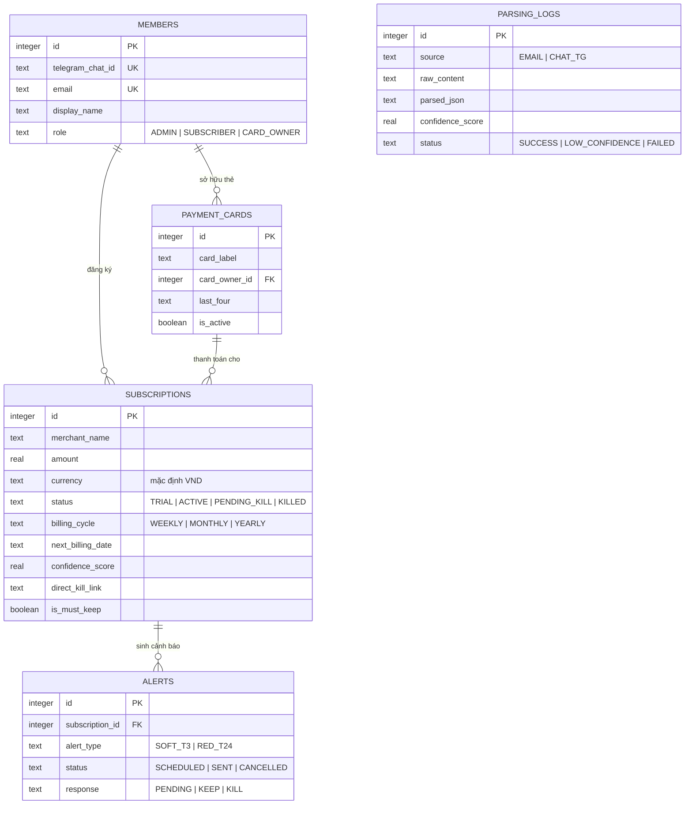
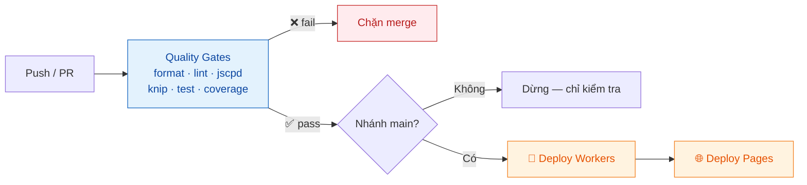

<div align="center">

# 🛡️ Subsentry

**Mạng lưới an toàn tài chính cho gia đình bạn**

_Không bao giờ bị trừ tiền oan vì quên hủy gói dùng thử._

[](https://github.com/trinhquocthinh/Subsentry/actions)
[](CHANGELOG.md)
[](#-chất-lượng--kiểm-thử)
[](LICENSE)

[](https://workers.cloudflare.com/)
[](https://hono.dev/)
[](https://www.typescriptlang.org/)
[](https://react.dev/)
[](https://core.telegram.org/bots/api)

[Tính năng](#-tính-năng-chính) · [Kiến trúc](#-kiến-trúc-hệ-thống) · [Bắt đầu nhanh](#-bắt-đầu-nhanh) · [API](#-api-reference) · [Tài liệu](#-bộ-tài-liệu-đặc-tả)

</div>

---

## 💡 Vấn đề

Một gia đình 10 người dùng chung Netflix, Spotify, iCloud, Canva, ChatGPT... Mỗi tháng có vài khoản bị trừ mà **không ai nhớ đã đăng ký lúc nào**. Gói dùng thử 7 ngày hết hạn lúc nửa đêm, không ai nhắc. Hai người mua hai gói cá nhân trong khi một gói Family rẻ hơn 40%.

Các app quản lý chi tiêu hiện có đòi quyền đọc **toàn bộ** hòm thư hoặc SMS của bạn. Không ai trong gia đình muốn vậy.

## ✅ Giải pháp

Subsentry là **mạng lưới an toàn cộng tác (cooperative safety net)** — không phải công cụ giám sát.

|                         | App quản lý chi tiêu thông thường | **Subsentry**                                         |
| ----------------------- | --------------------------------- | ----------------------------------------------------- |
| Quyền truy cập dữ liệu  | Toàn bộ hòm thư / SMS             | Chỉ email khớp domain nhà cung cấp, do bạn tự lọc     |
| Cài đặt trên điện thoại | Bắt buộc cài app theo dõi         | Không cài gì cả — dùng Telegram sẵn có                |
| Dữ liệu lưu ở đâu       | Server bên thứ ba                 | D1 database của chính bạn trên Cloudflare             |
| Chi phí vận hành        | 3–10 USD/tháng                    | **~0 USD** (nằm gọn trong free tier)                  |
| Cách ghi nhận giao dịch | Đồng bộ ngầm tự động              | Thành viên **chủ động** gửi ảnh biên lai / bật script |

---

## ✨ Tính năng chính

### 🤖 Bóc tách hóa đơn bằng AI

Gửi **ảnh chụp biên lai** hoặc **dán nội dung SMS** vào Telegram — `gpt-4o-mini` tự trích xuất tên dịch vụ, số tiền, chu kỳ và ngày gia hạn kế tiếp, kèm điểm tin cậy (`confidence_score`).

- Điểm tin cậy thấp → hệ thống hỏi lại thành viên thay vì đoán bừa
- Nội dung thô được sanitize trước khi vào prompt (chống prompt injection)
- OpenAI sập? Bản ghi lưu `status = FAILED` + cron tự retry, **không mất dữ liệu**

### 🚨 Cảnh báo đa tầng (Tiered Alerts)

Cơ chế leo thang hai mức đảm bảo không ai bỏ lỡ hạn hủy:



Mỗi cảnh báo đính kèm **inline button Keep / Kill** và `direct_kill_link` — hủy gói chỉ mất một chạm.

### 📥 Hai kênh tiếp nhận, zero-forwarding

| Kênh                         | Cách hoạt động                                                                           |
| ---------------------------- | ---------------------------------------------------------------------------------------- |
| **Telegram Bot**             | Gửi ảnh biên lai hoặc dán SMS trực tiếp vào chat                                         |
| **Google Apps Script**       | Script chạy trên Gmail cá nhân, 10 phút/lần, **chỉ** quét email khớp domain nhà cung cấp |
| **Cloudflare Email Routing** | Dành cho ai có tên miền riêng — nhận email hóa đơn qua địa chỉ chuyên dụng               |

> Không cần forward email đi đâu cả. Script chạy trên tài khoản của chính thành viên, chỉ POST phần dữ liệu hóa đơn đã lọc.

### 📊 Telegram Mini App + Google Sheets

- **Mini App (React SPA)**: dashboard chi tiêu, biểu đồ Recharts, thao tác Keep/Kill/sửa thẻ ngay trong Telegram
- **Google Sheets 2-way sync**: chỉnh sửa trên Sheet quen thuộc, cron đồng bộ ngược về D1 mỗi ngày

### 🔍 Phát hiện gói trùng lặp

Tự động cảnh báo khi phát hiện nhiều thành viên trả tiền riêng lẻ cho cùng một dịch vụ có gói Family rẻ hơn.

---

## 🧱 Kiến trúc hệ thống

Toàn bộ hệ thống chạy **serverless trên Cloudflare**, không có server nào phải bảo trì.



### Clean Architecture theo feature

Backend tổ chức theo **vertical slice** — mỗi feature tự chứa domain, use-case và adapter, phụ thuộc luôn hướng vào trong:

```
apps/backend/src/
├── core/                       # Shared kernel — dùng chung mọi feature
│   ├── db/                     # Drizzle client + schema (5 bảng)
│   ├── errors/                 # Global error handler + domain errors
│   ├── middleware/             # Logger, rate limiter
│   └── types/                  # Enum & type dùng chung
│
└── features/
    ├── parser/                 # 🧠 Bóc tách hóa đơn bằng AI
    │   ├── domain/             #    Interface & business rule thuần
    │   ├── use-cases/          #    Điều phối nghiệp vụ
    │   └── adapters/           #    OpenAIParserAdapter
    ├── subscription/           # 🔄 Máy trạng thái TRIAL→ACTIVE→PENDING_KILL→KILLED
    ├── alert/                  # 🚨 Cảnh báo đa tầng T-3 / T-24h
    ├── telegram/               # 💬 Webhook, inline keyboard, notification
    ├── email/                  # 📧 Email Routing + Apps Script ingestion
    ├── sheets/                 # 📗 Google Sheets 2-way sync
    ├── api/                    # 🌐 REST API cho Mini App
    └── admin/                  # 🔐 Endpoint quản trị (token-protected)
```

> Quy tắc: `domain/` **không** import gì từ `adapters/`. Muốn đổi OpenAI sang model khác, chỉ cần viết adapter mới.

### Mô hình dữ liệu



Chi tiết đầy đủ kèm ràng buộc CHECK: [docs/model-erd.md](docs/model-erd.md)

---

## 🛠️ Tech Stack

| Lớp               | Công nghệ                                                            |
| ----------------- | -------------------------------------------------------------------- |
| **Runtime**       | Cloudflare Workers · Node.js 22 LTS · TypeScript 6.0 (strict)        |
| **API**           | Hono 4.12                                                            |
| **Database**      | Cloudflare D1 (SQLite) · Drizzle ORM 0.45 · Drizzle Kit migrations   |
| **AI**            | OpenAI SDK 7.x — `gpt-4o-mini`                                       |
| **Email**         | Cloudflare Email Routing · `postal-mime` 2.3                         |
| **Frontend**      | React 18.3 · Vite 8 · Tailwind CSS 3 · TanStack Query 5 · Recharts 2 |
| **Deploy**        | Workers (backend) · Pages (frontend) · Wrangler 4                    |
| **Testing**       | Vitest 4 + Miniflare · Testing Library                               |
| **Quality Gates** | ESLint 9 (flat) · Prettier 3 · jscpd 5 · Knip 6 · Husky 9            |
| **Monorepo**      | Yarn Workspaces                                                      |

---

## 🚀 Bắt đầu nhanh

### Yêu cầu

- **Node.js** ≥ 22 · **Yarn** 1.22.x · **Git**
- Tài khoản **Cloudflare** (free tier là đủ)
- **OpenAI API key** · **Telegram bot token** (tạo qua [@BotFather](https://t.me/BotFather))

### Cài đặt

```bash
git clone https://github.com/trinhquocthinh/Subsentry.git
cd Subsentry
yarn install
```

### Khởi tạo database

```bash
# Tạo D1 database (chép database_id vào apps/backend/wrangler.toml)
yarn wrangler d1 create subsentry-db

yarn db:generate        # Sinh migration từ Drizzle schema
yarn db:migrate:local   # Áp dụng lên D1 local
yarn db:seed:local      # Nạp dữ liệu mẫu (idempotent, chạy lại an toàn)
```

### Chạy môi trường dev

```bash
yarn backend:dev    # Worker  → http://localhost:8787
yarn frontend:dev   # Mini App → http://localhost:5173
```

Kiểm tra Worker đã sống:

```bash
curl http://localhost:8787/health-check
```

### Deploy lên production

```bash
yarn db:migrate:prod
yarn backend:deploy
yarn frontend:build
```

Đăng ký webhook Telegram **một lần duy nhất** sau khi deploy:

```bash
TELEGRAM_BOT_TOKEN=xxx \
TELEGRAM_WEBHOOK_SECRET=yyy \
WORKER_URL=https://subsentry-backend.<subdomain>.workers.dev \
  ./apps/backend/scripts/set-telegram-webhook.sh
```

📖 Hướng dẫn từng bước chi tiết: [docs/setup-and-ops-guide.md](docs/setup-and-ops-guide.md)

---

## 🔑 Biến môi trường

Đặt qua `wrangler secret put <TÊN>` — **không bao giờ** commit vào repo.

| Secret                               | Bắt buộc | Mục đích                                          |
| ------------------------------------ | :------: | ------------------------------------------------- |
| `OPENAI_API_KEY`                     |    ✅    | Gọi `gpt-4o-mini` bóc tách hóa đơn                |
| `TELEGRAM_BOT_TOKEN`                 |    ✅    | Gửi tin nhắn và nhận update                       |
| `TELEGRAM_WEBHOOK_SECRET`            |    ✅    | Xác thực header `X-Telegram-Bot-Api-Secret-Token` |
| `TELEGRAM_FAMILY_GROUP_CHAT_ID`      |    ✅    | Group chat nhận Red Alert ở mốc T-24h             |
| `ADMIN_API_TOKEN`                    |    ✅    | Bảo vệ `/api/admin/*`                             |
| `GMAIL_WEBHOOK_SECRET`               |    ⬜    | Xác thực POST từ Google Apps Script               |
| `ALLOWED_EMAIL_TO`                   |    ⬜    | Whitelist địa chỉ nhận của Email Routing          |
| `GOOGLE_SHEET_ID`                    |    ⬜    | Bật đồng bộ Google Sheets                         |
| `GOOGLE_SERVICE_ACCOUNT_EMAIL`       |    ⬜    | Service account đọc/ghi Sheet                     |
| `GOOGLE_SERVICE_ACCOUNT_PRIVATE_KEY` |    ⬜    | Private key của service account                   |

> ⬜ = tùy chọn. Thiếu nhóm `GOOGLE_*` → tính năng Sheets tự tắt, phần còn lại vẫn chạy bình thường.

---

## 📡 API Reference

### Public webhooks

| Method | Endpoint            | Bảo vệ                               |
| ------ | ------------------- | ------------------------------------ |
| `POST` | `/webhook/telegram` | Secret token header · 60 req/phút    |
| `POST` | `/webhook/email`    | `GMAIL_WEBHOOK_SECRET` · 60 req/phút |

### REST API — Telegram Mini App (`/api/v1`)

Xác thực bằng header `X-Telegram-Init-Data`.

| Method  | Endpoint             | Mô tả                                                |
| ------- | -------------------- | ---------------------------------------------------- |
| `GET`   | `/subscriptions`     | Danh sách gói đăng ký kèm thành viên & chủ thẻ       |
| `GET`   | `/subscriptions/:id` | Chi tiết một gói                                     |
| `PATCH` | `/subscriptions/:id` | Cập nhật trạng thái (Keep/Kill), thẻ, `is_must_keep` |
| `GET`   | `/members`           | Danh sách thành viên gia đình                        |
| `GET`   | `/payment-cards`     | Danh sách thẻ thanh toán                             |
| `GET`   | `/stats/spending`    | Thống kê chi tiêu cho dashboard                      |

### Admin (`/api/admin`)

Yêu cầu `ADMIN_API_TOKEN` · giới hạn 10 req/phút.

| Method | Endpoint          | Mô tả                             |
| ------ | ----------------- | --------------------------------- |
| `POST` | `/reconcile-sync` | Ép đồng bộ lại D1 ↔ Google Sheets |

### Cron job — `0 1 * * *` (01:00 UTC hằng ngày)

Mỗi lần chạy thực hiện song song: quét & gửi **cảnh báo đa tầng** → **retry** các bản ghi parse lỗi → **đồng bộ** Google Sheets.

---

## 🧪 Chất lượng & kiểm thử

Toàn bộ quality gate chạy ở **pre-commit hook** và **CI** — không có đường vòng.

```bash
yarn verify            # Chạy tuần tự tất cả cổng bên dưới
```

| Cổng            | Lệnh                   | Ngưỡng                                |
| --------------- | ---------------------- | ------------------------------------- |
| Format          | `yarn format:check`    | Prettier — không sai lệch             |
| Lint            | `yarn lint`            | ESLint — 0 error                      |
| Trùng lặp mã    | `yarn duplicate:check` | jscpd                                 |
| Mã chết         | `yarn deadcode:check`  | Knip — 0 unused export                |
| Test + coverage | `yarn test`            | lines 85 / functions 90 / branches 80 |
| Test frontend   | `yarn test:frontend`   | Vitest + jsdom                        |

**Coverage thực tế** — 35 test file phủ 87 file nguồn:

| Chỉ số     | Đạt        | Ngưỡng |
| ---------- | ---------- | ------ |
| Lines      | **94.15%** | 85%    |
| Statements | **94.14%** | 85%    |
| Functions  | **91.76%** | 90%    |
| Branches   | **84.47%** | 80%    |

📖 Đặc tả test case & test vector: [docs/test-cases-specification.md](docs/test-cases-specification.md)

---

## 🔄 CI/CD

`.github/workflows/deploy.yml` chạy trên mọi push và pull request vào `main`:



---

## 🛟 Sao lưu & khôi phục

```bash
yarn db:backup     # → apps/backend/backups/backup-subsentry-YYYY-MM-DD.sql
yarn db:restore    # Khôi phục từ file .sql
```

Lịch khuyến nghị: chạy backup **ngày 1 mỗi tháng** và trước mọi thay đổi lớn, upload file `.sql` lên Google Drive.

Hệ thống có sẵn kịch bản xử lý cho: OpenAI outage, lỗi đồng bộ Sheets, mất dữ liệu D1, Telegram webhook chết.

📖 [docs/dr-runbook.md](docs/dr-runbook.md) — playbook thao tác nhanh
📖 [docs/disaster-recovery-fallback.md](docs/disaster-recovery-fallback.md) — phân tích chi tiết từng kịch bản

---

## 🔒 Bảo mật & quyền riêng tư

- **Truy cập dữ liệu tối thiểu** — không đọc hòm thư hay SMS cá nhân; chỉ nhận thứ thành viên chủ động gửi
- **Xác thực chữ ký webhook** — mọi webhook Telegram kiểm tra secret token; Apps Script kiểm tra shared secret
- **Rate limiting** — 60 req/phút cho webhook, 10 req/phút cho admin (Cloudflare Rate Limiting binding)
- **Chống prompt injection** — sanitize nội dung thô trước khi đưa vào prompt AI
- **Không lưu số thẻ** — chỉ lưu nhãn thẻ và 4 số cuối
- **Secrets qua Wrangler** — không có credential nào nằm trong repo
- **Ràng buộc ở tầng DB** — CHECK constraint trên mọi cột enum, không chỉ validate ở application layer

📖 [docs/business-rules.md](docs/business-rules.md) BR-01 → BR-09 · [docs/sdd.md](docs/sdd.md) §4

---

## 📚 Bộ tài liệu đặc tả

Dự án được xây dựng theo **Spec-Driven Development** — code viết sau khi đặc tả được duyệt.

| Tài liệu                                                            | Nội dung                                  | Version |
| ------------------------------------------------------------------- | ----------------------------------------- | :-----: |
| [problem-definition.md](docs/problem-definition.md)                 | Định nghĩa bài toán & bối cảnh            |   1.2   |
| [prd.md](docs/prd.md)                                               | Product Requirements Document             |   1.2   |
| [business-rules.md](docs/business-rules.md)                         | Quy tắc nghiệp vụ BR-01 → BR-09           |   1.2   |
| [techspec.md](docs/techspec.md)                                     | Đặc tả kỹ thuật & kiến trúc               |   1.2   |
| [sdd.md](docs/sdd.md)                                               | Máy trạng thái & thiết kế API webhook     |   1.5   |
| [model-c4.md](docs/model-c4.md)                                     | Sơ đồ C4 — Context & Container            |   1.2   |
| [model-erd.md](docs/model-erd.md)                                   | Sơ đồ ERD chi tiết (3NF)                  |   1.2   |
| [model-flowchart.md](docs/model-flowchart.md)                       | Lưu đồ nghiệp vụ AI parsing & escalation  |   1.2   |
| [model-sequence.md](docs/model-sequence.md)                         | Sơ đồ tuần tự tương tác thời gian thực    |   1.2   |
| [test-cases-specification.md](docs/test-cases-specification.md)     | Kịch bản kiểm thử & test vector           |   1.2   |
| [setup-and-ops-guide.md](docs/setup-and-ops-guide.md)               | Hướng dẫn cài đặt & vận hành              |   1.4   |
| [disaster-recovery-fallback.md](docs/disaster-recovery-fallback.md) | Phân tích kịch bản sự cố                  |   1.2   |
| [dr-runbook.md](docs/dr-runbook.md)                                 | Playbook backup & restore                 |   1.0   |
| [family-onboarding-guide.md](docs/family-onboarding-guide.md)       | Hướng dẫn cho thành viên gia đình         |   1.3   |
| [master-plan.md](docs/master-plan.md)                               | Kế hoạch triển khai Epic → Task → Subtask |  1.15   |

---

## 🗺️ Trạng thái dự án

**v1.0.0 GA — đã Go-Live** (10/08/2026). Toàn bộ 15 epic hoàn thành:

| Epic  | Hạng mục                                     |  Trạng thái  |
| :---: | -------------------------------------------- | :----------: |
|  0–2  | Bootstrap · Data Layer · Shared Kernel       |      ✅      |
|  3–5  | AI Parser · State Machine · Tiered Alerts    |      ✅      |
|   6   | ~~Zalo OA~~ — thay bằng Telegram (Epic 7)    |      ⚫      |
|  7–8  | Telegram Bot · Email Ingestion               |      ✅      |
| 9–11  | Google Sheets Sync · Admin Ops · React SPA   |      ✅      |
| 12–13 | Bảo mật & Tuân thủ · Testing & Quality Gates |      ✅      |
| 14–15 | Disaster Recovery · Onboarding & Go-Live     |      ✅      |
|  16   | Vận hành & cải tiến liên tục                 | 🔄 Đang chạy |

> **Về Epic 6:** Zalo OA bị loại bỏ do rào cản nền tảng thật sự — bắt buộc xác minh doanh nghiệp, không có API gửi Group Chat, cửa sổ nhắn tin chủ động chỉ 7 ngày. Telegram Bot vốn đã được thiết kế làm kênh song song ngay từ đầu nên việc thay thế diễn ra sạch sẽ. Chi tiết: [docs/master-plan.md](docs/master-plan.md) §Epic 6.

📋 Nhật ký thay đổi đầy đủ: [CHANGELOG.md](CHANGELOG.md)

---

## 🤝 Đóng góp

Đây là dự án Quality-of-Life phi thương mại cho một gia đình cụ thể, nhưng issue và PR luôn được chào đón.

Trước khi mở PR, chạy:

```bash
yarn verify
```

Pre-commit hook sẽ tự động chặn nếu bất kỳ cổng nào fail.

---

## 📄 Giấy phép

[MIT](LICENSE) © 2026 Thinh Quoc

<div align="center">

---

_Xây dựng cho gia đình, với sự tôn trọng tuyệt đối quyền riêng tư._ 🏡

</div>
