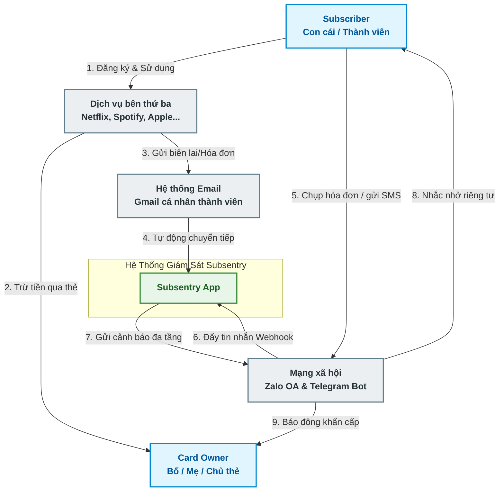
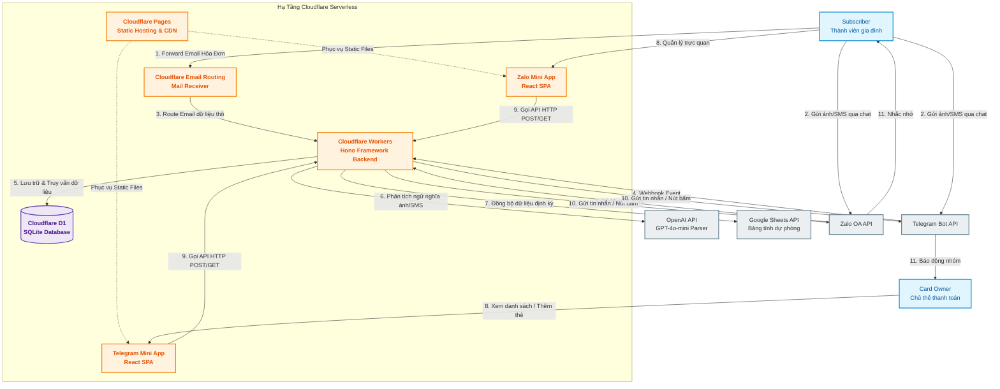

### 🌐 C4 ARCHITECTURE MODEL — Subsentry

**Sơ Đồ Kiến Trúc Hệ Thống Theo Mô Hình C4 (C1 Context & C2 Container)** | _Enterprise-Grade System Design for Quality-of-Life Family Project_
**Document Version:** 1.0 | **Status:** Approved
---

#### 1. C1 - Sơ Đồ Ngữ Cảnh Hệ Thống (System Context Diagram)

Mức C1 mô tả ranh giới hệ thống, các tác nhân bên ngoài (Thành viên gia đình, Chủ thẻ) và các hệ thống bên thứ ba tích hợp với **Subsentry**.

---

#### 2. C2 - Sơ Đồ Thành Phần Hệ Thống (Container Diagram)

Mức C2 đi sâu vào bên trong ranh giới của **Subsentry System**, mô tả các container logic (Frontend, Backend, Database) chạy trên môi trường **Serverless Cloudflare** và cách chúng tương tác qua lại.

---

#### 3. Mô Tả Chi Tiết Nhiệm Vụ Các Container (Container Specifications)

##### 3.1 Frontend: Zalo Mini App / Telegram Mini App (React SPA)

- **Công nghệ:** React v18.3.x, TypeScript, Tailwind CSS, Vite v5.x.
- **Lưu trữ (Hosting):** Cloudflare Pages (Serverless Hosting).
- **Mô tả nhiệm vụ:**
  - Cung cấp giao diện Dashboard tối giản, hiển thị trực quan biểu đồ hình tròn phân phối chi tiêu, danh sách các gói đăng ký đang hoạt động, danh sách thẻ thanh toán và đồng hồ đếm ngược ngày gia hạn (`Next Billing Date`).
  - Cung cấp giao diện tương tác cho phép cấu hình nhanh: Gán chủ thẻ, chỉnh sửa số tiền, đổi ngày gia hạn thủ công mà không cần dùng câu lệnh chat.
  - Tích hợp sâu thông qua Zalo SDK (Zalo Mini App) và Telegram Web App SDK (`window.Telegram.WebApp`) để lấy thông tin `User ID` tự động mà không bắt người dùng đăng nhập lại.

##### 3.2 Backend: Cloudflare Workers (Hono API)

- **Công nghệ:** TypeScript, Hono Framework v4.5.x, Drizzle ORM v0.32.x.
- **Mô tả nhiệm vụ:**
  - Làm xương sống xử lý toàn bộ logic nghiệp vụ (Core Domain Logic).
  - Cung cấp các cổng API (Endpoints) tiếp nhận Webhook từ Zalo OA, Telegram Bot và hệ thống Mail.
  - Thực hiện cơ chế kiểm soát chất lượng dữ liệu: Đọc dữ liệu, gọi API OpenAI GPT-4o-mini để bóc tách hóa đơn, kiểm tra ngưỡng tin cậy (`Confidence Score >= 0.85`), xử lý ghi nhận D1 Database.
  - Vận hành bộ lập lịch (Cron Triggers) để quét D1 hàng ngày lúc 08:00 sáng, tự động tính toán thời gian `T-3` và `T-24h` để gửi tin nhắn cảnh báo đa tầng tới đúng thành viên gia đình.

##### 3.3 Database: Cloudflare D1 (SQLite)

- **Công nghệ:** Cloudflare D1 Native SQLite engine.
- **Mô tả nhiệm vụ:**
  - Lưu trữ dữ liệu có cấu trúc ổn định của 10 thành viên gia đình, thẻ tín dụng, lịch sử cảnh báo và nhật ký xử lý dữ liệu của AI.
  - Hỗ trợ cơ chế giao dịch (Transactions) để đảm bảo dữ liệu ghi nhận đồng bộ, không bị xung đột khi nhiều webhook đẩy về cùng một lúc.

##### 3.4 Email Receiver: Cloudflare Email Routing

- **Công nghệ:** Cloudflare Mail Routing Engine.
- **Mô tả nhiệm vụ:**
  - Làm phễu đón nhận các thư điện tử chuyển tiếp từ Gmail cá nhân của 10 thành viên gia đình gửi về địa chỉ tập trung `subs@yourfamily.com`.
  - Mã hóa và chuyển tiếp (forward) toàn bộ tiêu đề (Subject), nội dung văn bản (Body Text/HTML) của email dưới dạng payload HTTP POST sang cho Cloudflare Workers xử lý, tránh việc phải dựng một máy chủ nhận Mail (IMAP/SMTP) tốn chi phí.

##### 3.5 Ghi chú mở rộng tương lai: Notion API (Tùy chọn)

Notion API **không** nằm trong kiến trúc container hiện tại ở sơ đồ C2. Đây là phương án dự phòng được cân nhắc tích hợp trong tương lai nếu Google Sheets API không còn đáp ứng đủ nhu cầu vận hành (ví dụ giới hạn quota, thiếu tính năng). Khi triển khai, Notion sẽ được tích hợp như một container thay thế tương đương `SHEETS`, không ảnh hưởng tới các thành phần còn lại của hệ thống.
