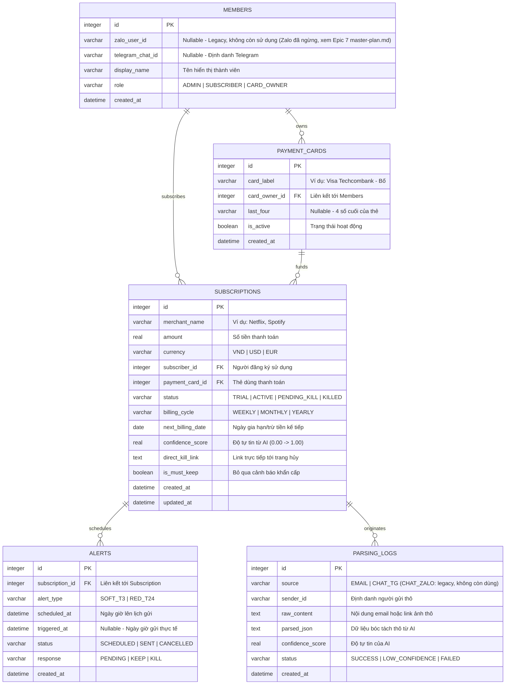

### 📊 ERD MODEL — Subsentry

**Sơ Đồ Thực Thể Quan Hệ Chi Tiết (Entity-Relationship Diagram)** | _Database Schema Specification for Cloudflare D1 (SQLite) via Drizzle ORM_

**Document Version:** 1.2 | **Status:** Approved | **Last Updated:** 2026-08-10

---

#### 1. Sơ Đồ Mermaid ERD (Visual Diagram)

Dưới đây là sơ đồ thực thể quan hệ (ERD) chi tiết, được chuẩn hóa ở dạng chuẩn 3NF, mô tả cấu trúc lưu trữ dữ liệu của Subsentry trên cơ sở dữ liệu **Cloudflare D1 (SQLite)**.



---

#### 2. Đặc Tả Chi Tiết Các Bảng Dữ Liệu (Table Schema)

##### 2.1 Bảng `members`

Lưu trữ thông tin định danh và phân quyền của 10 thành viên trong gia đình.

| Tên trường (Column) | Kiểu dữ liệu   | Ràng buộc                   | Mô tả                                                                                                                                     |
| :------------------ | :------------- | :-------------------------- | :---------------------------------------------------------------------------------------------------------------------------------------- |
| `id`                | `INTEGER`      | `PRIMARY KEY AUTOINCREMENT` | Khóa chính tự tăng                                                                                                                        |
| `zalo_user_id`      | `VARCHAR(255)` | `UNIQUE`, `NULLABLE`        | **[Legacy]** ID Zalo, không còn sử dụng sau khi Epic 6 Zalo OA bị ngừng, thay bằng Telegram (xem [master-plan.md](master-plan.md) Epic 7) |
| `telegram_chat_id`  | `VARCHAR(255)` | `UNIQUE`, `NULLABLE`        | Chat ID định danh người dùng trên Telegram                                                                                                |
| `display_name`      | `VARCHAR(100)` | `NOT NULL`                  | Tên gọi thân mật của thành viên trong nhà                                                                                                 |
| `role`              | `VARCHAR(20)`  | `NOT NULL`                  | Vai trò: `'ADMIN'` (Bố/Mẹ), `'SUBSCRIBER'`, `'CARD_OWNER'`                                                                                |
| `created_at`        | `DATETIME`     | `DEFAULT CURRENT_TIMESTAMP` | Thời điểm đăng ký vào hệ thống                                                                                                            |

##### 2.2 Bảng `payment_cards`

Danh sách thẻ thanh toán liên kết ngân hàng của gia đình.

| Tên trường (Column) | Kiểu dữ liệu   | Ràng buộc                      | Mô tả                                                  |
| :------------------ | :------------- | :----------------------------- | :----------------------------------------------------- |
| `id`                | `INTEGER`      | `PRIMARY KEY AUTOINCREMENT`    | Khóa chính tự tăng                                     |
| `card_label`        | `VARCHAR(100)` | `NOT NULL`                     | Tên nhãn dễ nhận diện (Ví dụ: "Visa Techcombank - Bố") |
| `card_owner_id`     | `INTEGER`      | `FOREIGN KEY` -> `members(id)` | Khóa ngoại trỏ đến chủ sở hữu thẻ thực tế              |
| `last_four`         | `VARCHAR(4)`   | `NULLABLE`                     | 4 số cuối của thẻ tín dụng để dễ kiểm tra              |
| `is_active`         | `BOOLEAN`      | `DEFAULT TRUE`                 | Trạng thái thẻ còn hoạt động để liên kết hay không     |
| `created_at`        | `DATETIME`     | `DEFAULT CURRENT_TIMESTAMP`    | Thời điểm tạo bản ghi                                  |

> 🔒 **Bảo mật (BR-09):** Bảng này tuyệt đối không được bổ sung cột lưu số thẻ đầy đủ (PAN), CVV/CVC hoặc ngày hết hạn thẻ dưới bất kỳ hình thức nào.

##### 2.3 Bảng `subscriptions`

Thực thể trung tâm lưu trữ thông tin các gói dịch vụ dùng thử hoặc đăng ký định kỳ.

| Tên trường (Column) | Kiểu dữ liệu   | Ràng buộc                            | Mô tả                                                           |
| :------------------ | :------------- | :----------------------------------- | :-------------------------------------------------------------- |
| `id`                | `INTEGER`      | `PRIMARY KEY AUTOINCREMENT`          | Khóa chính tự tăng                                              |
| `merchant_name`     | `VARCHAR(100)` | `NOT NULL`                           | Tên nhà cung cấp dịch vụ được chuẩn hóa (Netflix, Spotify...)   |
| `amount`            | `REAL`         | `NOT NULL`                           | Số tiền cần thanh toán của chu kỳ                               |
| `currency`          | `VARCHAR(10)`  | `DEFAULT 'VND'`                      | Đơn vị tiền tệ thanh toán (`VND`, `USD`...)                     |
| `subscriber_id`     | `INTEGER`      | `FOREIGN KEY` -> `members(id)`       | Khóa ngoại trỏ đến người đăng ký sử dụng                        |
| `payment_card_id`   | `INTEGER`      | `FOREIGN KEY` -> `payment_cards(id)` | Khóa ngoại trỏ đến thẻ thanh toán liên kết gánh phí             |
| `status`            | `VARCHAR(20)`  | `NOT NULL`                           | Trạng thái: `'TRIAL'`, `'ACTIVE'`, `'PENDING_KILL'`, `'KILLED'` |
| `billing_cycle`     | `VARCHAR(20)`  | `NOT NULL`                           | Chu kỳ: `'WEEKLY'`, `'MONTHLY'`, `'YEARLY'`                     |
| `next_billing_date` | `DATE`         | `NOT NULL`                           | Ngày dự đoán trừ tiền tiếp theo                                 |
| `confidence_score`  | `REAL`         | `NOT NULL`                           | Độ tin cậy dữ liệu phân tích từ AI (0.00 đến 1.00)              |
| `direct_kill_link`  | `TEXT`         | `NULLABLE`                           | Link URL dẫn thẳng tới mục quản lý/hủy gói của dịch vụ          |
| `is_must_keep`      | `BOOLEAN`      | `DEFAULT FALSE`                      | Cờ đánh dấu gói dịch vụ thiết yếu, bỏ qua Red Alert             |
| `created_at`        | `DATETIME`     | `DEFAULT CURRENT_TIMESTAMP`          | Thời điểm tạo gói giám sát                                      |
| `updated_at`        | `DATETIME`     | `DEFAULT CURRENT_TIMESTAMP`          | Thời điểm cập nhật bản ghi gần nhất                             |

##### 2.4 Bảng `alerts`

Quản lý lập lịch và lưu trữ lịch sử phản hồi thông báo của các chu kỳ.

| Tên trường (Column) | Kiểu dữ liệu  | Ràng buộc                            | Mô tả                                                    |
| :------------------ | :------------ | :----------------------------------- | :------------------------------------------------------- |
| `id`                | `INTEGER`     | `PRIMARY KEY AUTOINCREMENT`          | Khóa chính tự tăng                                       |
| `subscription_id`   | `INTEGER`     | `FOREIGN KEY` -> `subscriptions(id)` | Khóa ngoại liên kết tới gói đăng ký                      |
| `alert_type`        | `VARCHAR(20)` | `NOT NULL`                           | Phân tầng: `'SOFT_T3'` hoặc `'RED_T24'`                  |
| `scheduled_at`      | `DATETIME`    | `NOT NULL`                           | Thời gian hệ thống dự kiến sẽ kích hoạt gửi thông báo    |
| `triggered_at`      | `DATETIME`    | `NULLABLE`                           | Thời gian gửi thông báo thực tế ra ứng dụng chat         |
| `status`            | `VARCHAR(20)` | `DEFAULT 'SCHEDULED'`                | Trạng thái: `'SCHEDULED'`, `'SENT'`, `'CANCELLED'`       |
| `response`          | `VARCHAR(20)` | `DEFAULT 'PENDING'`                  | Phản hồi của người dùng: `'PENDING'`, `'KEEP'`, `'KILL'` |
| `created_at`        | `DATETIME`    | `DEFAULT CURRENT_TIMESTAMP`          | Thời điểm tạo tác vụ cảnh báo                            |

##### 2.5 Bảng `parsing_logs`

Nhật ký bóc tách dữ liệu từ AI để lưu trữ dữ liệu thô phục vụ tối ưu Prompt và kiểm toán lỗi.

| Tên trường (Column) | Kiểu dữ liệu   | Ràng buộc                   | Mô tả                                                                                          |
| :------------------ | :------------- | :-------------------------- | :--------------------------------------------------------------------------------------------- |
| `id`                | `INTEGER`      | `PRIMARY KEY AUTOINCREMENT` | Khóa chính tự tăng                                                                             |
| `source`            | `VARCHAR(20)`  | `NOT NULL`                  | Nguồn: `'EMAIL'`, `'CHAT_TG'` (`'CHAT_ZALO'` là giá trị legacy, không còn được tạo mới)        |
| `sender_id`         | `VARCHAR(255)` | `NOT NULL`                  | Telegram Chat ID hoặc email gửi thô để định danh (giá trị Zalo ID cũ chỉ còn ở dữ liệu legacy) |
| `raw_content`       | `TEXT`         | `NOT NULL`                  | Email text thô hoặc URL ảnh biên lai lưu trên Cloudflare Images                                |
| `parsed_json`       | `TEXT`         | `NULLABLE`                  | Kết quả chuỗi JSON string nhận về từ GPT-4o-mini                                               |
| `confidence_score`  | `REAL`         | `DEFAULT 0.00`              | Điểm số tự tin của mô hình                                                                     |
| `status`            | `VARCHAR(20)`  | `NOT NULL`                  | Trạng thái lưu trữ: `'SUCCESS'`, `'LOW_CONFIDENCE'`, `'FAILED'`                                |
| `created_at`        | `DATETIME`     | `DEFAULT CURRENT_TIMESTAMP` | Thời điểm xử lý giao dịch                                                                      |

---

#### 3. Định Nghĩa Drizzle ORM Schema (TypeScript)

Đoạn mã cấu hình TypeScript Schema cho **Drizzle ORM** giúp ánh xạ đồng bộ trực tiếp cấu trúc trên xuống Cloudflare D1.

```typescript
import { sqliteTable, integer, text, real } from 'drizzle-orm/sqlite-core';
import { sql } from 'drizzle-orm';

// 1. Members Table
export const members = sqliteTable('members', {
  id: integer('id').primaryKey({ autoIncrement: true }),
  zaloUserId: text('zalo_user_id').unique(),
  telegramChatId: text('telegram_chat_id').unique(),
  displayName: text('display_name').notNull(),
  role: text('role', { enum: ['ADMIN', 'SUBSCRIBER', 'CARD_OWNER'] }).notNull(),
  createdAt: text('created_at').default(sql`CURRENT_TIMESTAMP`),
});

// 2. Payment Cards Table
export const paymentCards = sqliteTable('payment_cards', {
  id: integer('id').primaryKey({ autoIncrement: true }),
  cardLabel: text('card_label').notNull(),
  cardOwnerId: integer('card_owner_id')
    .references(() => members.id, { onDelete: 'cascade' })
    .notNull(),
  lastFour: text('last_four'),
  isActive: integer('is_active', { mode: 'boolean' }).default(true),
  createdAt: text('created_at').default(sql`CURRENT_TIMESTAMP`),
});

// 3. Subscriptions Table
export const subscriptions = sqliteTable('subscriptions', {
  id: integer('id').primaryKey({ autoIncrement: true }),
  merchantName: text('merchant_name').notNull(),
  amount: real('amount').notNull(),
  currency: text('currency').default('VND').notNull(),
  subscriberId: integer('subscriber_id')
    .references(() => members.id)
    .notNull(),
  paymentCardId: integer('payment_card_id')
    .references(() => paymentCards.id)
    .notNull(),
  status: text('status', { enum: ['TRIAL', 'ACTIVE', 'PENDING_KILL', 'KILLED'] }).notNull(),
  billingCycle: text('billing_cycle', { enum: ['WEEKLY', 'MONTHLY', 'YEARLY'] }).notNull(),
  nextBillingDate: text('next_billing_date').notNull(), // ISO Date String: YYYY-MM-DD
  confidenceScore: real('confidence_score').notNull(),
  directKillLink: text('direct_kill_link'),
  isMustKeep: integer('is_must_keep', { mode: 'boolean' }).default(false),
  createdAt: text('created_at').default(sql`CURRENT_TIMESTAMP`),
  updatedAt: text('updated_at').default(sql`CURRENT_TIMESTAMP`),
});

// 4. Alerts Table
export const alerts = sqliteTable('alerts', {
  id: integer('id').primaryKey({ autoIncrement: true }),
  subscriptionId: integer('subscription_id')
    .references(() => subscriptions.id, { onDelete: 'cascade' })
    .notNull(),
  alertType: text('alert_type', { enum: ['SOFT_T3', 'RED_T24'] }).notNull(),
  scheduledAt: text('scheduled_at').notNull(), // ISO DateTime String
  triggeredAt: text('triggered_at'), // ISO DateTime String
  status: text('status', { enum: ['SCHEDULED', 'SENT', 'CANCELLED'] })
    .default('SCHEDULED')
    .notNull(),
  response: text('response', { enum: ['PENDING', 'KEEP', 'KILL'] })
    .default('PENDING')
    .notNull(),
  createdAt: text('created_at').default(sql`CURRENT_TIMESTAMP`),
});

// 5. Parsing Logs Table
export const parsingLogs = sqliteTable('parsing_logs', {
  id: integer('id').primaryKey({ autoIncrement: true }),
  source: text('source', { enum: ['EMAIL', 'CHAT_ZALO', 'CHAT_TG'] }).notNull(),
  senderId: text('sender_id').notNull(),
  rawContent: text('raw_content').notNull(),
  parsedJson: text('parsed_json'),
  confidenceScore: real('confidence_score').default(0.0),
  status: text('status', { enum: ['SUCCESS', 'LOW_CONFIDENCE', 'FAILED'] }).notNull(),
  createdAt: text('created_at').default(sql`CURRENT_TIMESTAMP`),
});
```
