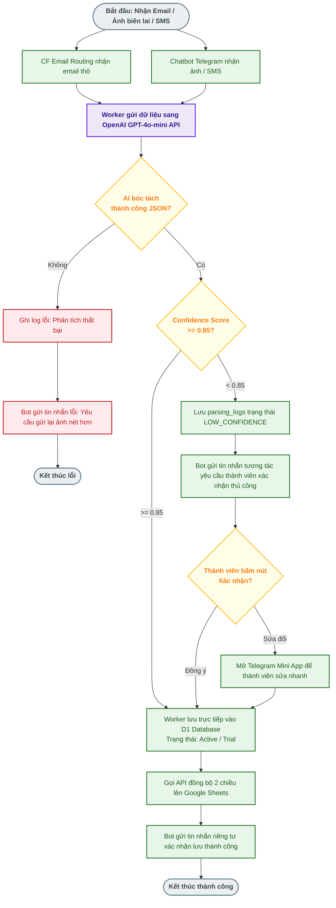
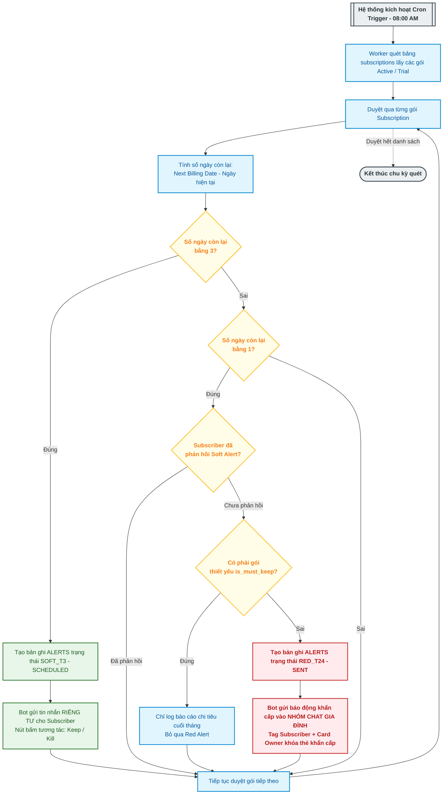

### 📊 BUSINESS FLOWCHARTS — Subsentry

**Lưu Đồ Nghiệp Vụ Xử Lý Dữ Liệu & Cảnh Báo Đa Tầng** | _Visual Flowcharts detailing AI Parsing Validation & Escalation Logic_

**Document Version:** 1.2 | **Status:** Approved | **Last Updated:** 2026-08-10

---

#### 1. Lưu Đồ Xử Lý & Xác Thực Biên Lai Bằng AI (AI Parsing Validation)

Lưu đồ dưới đây thể hiện quy trình khép kín khi hệ thống nhận diện biên lai (Email forwarded hoặc Ảnh chụp màn hình gửi qua Chatbot), chuyển dịch qua mô hình **GPT-4o-mini**, xác thực độ tin cậy và ghi nhận dữ liệu.

---

#### 2. Lưu Đồ Hệ Thống Cảnh Báo Cộng Tác Đa Tầng (Tiered Escalation Alerts)

Quy trình tự động hóa lập lịch cảnh báo của Subsentry, quét cơ sở dữ liệu định kỳ bằng **Cloudflare Workers Cron Trigger (08:00 AM hàng ngày)** để đưa ra cảnh báo leo thang.

