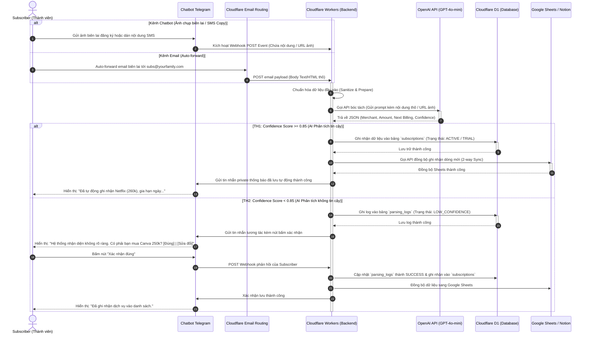
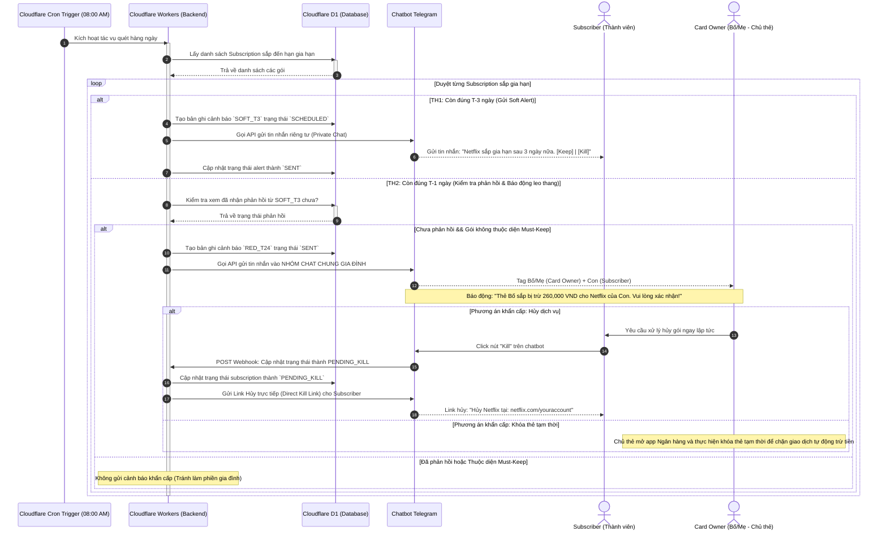

### 📊 SEQUENCE DIAGRAMS — Subsentry

**Sơ Đồ Tuần Tự Tương Tác Thời Gian Thực** | _UML Sequence Diagrams for Real-time Transaction Parsing and Alert Response_

**Document Version:** 1.2 | **Status:** Approved | **Last Updated:** 2026-08-10

---

#### 1. Luồng Bóc Tách Hóa Đơn Tự Động (Real-time Transaction Parsing Sequence)

Sơ đồ tuần tự này mô tả vòng đời của một giao dịch từ khi **Subscriber** chụp hóa đơn gửi vào Chatbot hoặc cấu hình chuyển tiếp email, đi qua bộ xử lý của **Cloudflare Workers** và **OpenAI API**, cho đến khi dữ liệu được lưu trữ, đồng bộ và phản hồi.

---

#### 2. Luồng Phản Hồi Cảnh Báo Đa Tầng & Leo Thang (Escalation Alert & Response Sequence)

Sơ đồ mô tả chi tiết quy trình xử lý khi mốc thời gian trừ tiền đến gần. Mô tả sự phối hợp giữa bộ lập lịch **Cron Trigger**, phản hồi riêng tư của **Subscriber** (T-3), và cơ chế báo động leo thang khẩn cấp gửi tới **Card Owner** (T-24h) trên nhóm chat chung.

